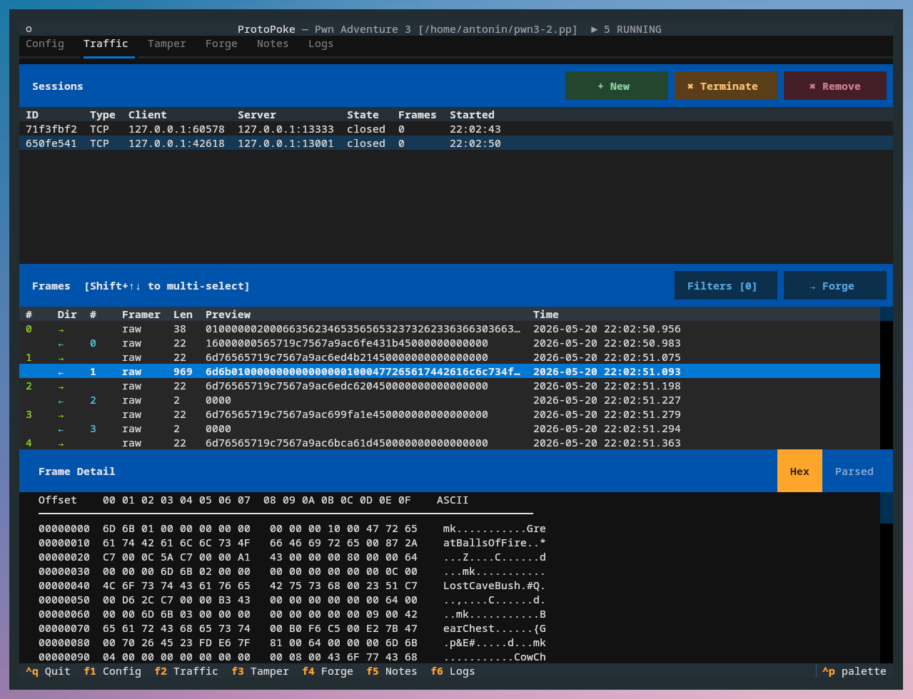

**A TCP / UDP / SOCKS5 proxy and protocol-analysis tool — Burp Suite for arbitrary binary protocols.**

ProtoPoke sits between a client and a server, captures every message that
crosses the wire, and lets you inspect, decode, modify, drop, replay, or
hand-craft traffic in real time. If you have ever wanted "Burp Suite, but for
a custom binary game protocol" — that is ProtoPoke.

---

## What it does

- **Proxies any connection** — each forwarder is a plain **TCP** proxy, a
  **UDP** proxy (per-client-tuple flows), or a **SOCKS5** proxy that learns
  its upstream target from the SOCKS handshake. Run many forwarders and many
  concurrent sessions at once.
- **Intercepts frames live** — pause messages mid-stream, inspect them, edit
  the raw bytes or named protocol fields, then forward or drop them.
- **Decodes binary protocols** — describe a protocol in a YAML/JSON
  definition and frames are parsed into named, typed fields with a
  Wireshark-style hex + tree view.
- **Rewrites traffic automatically** — ordered replace rules (binary pattern,
  regex, or custom Python script) transform frames as they flow through.
- **Forges and replays** — hand-craft frames from scratch, replay captured
  sessions (optionally with field edits), or build reusable playbooks.
- **TLS / MITM** — auto-generated root CA and per-session certificates let
  ProtoPoke decrypt, modify, and re-encrypt TLS traffic.
- **AI-controllable** — an embedded MCP server exposes every proxy operation
  as a tool, so an AI assistant can drive the same session you see on screen.

Mutation fuzzing exists in the codebase but is **experimental** and
intentionally undocumented.

---

## Two ways to use it

ProtoPoke has one engine and two front ends. Pick whichever fits the task.

| | **User Interface** | **Core Library** |
|---|---|---|
| What | A full terminal UI (Textual) with Config, Traffic, Intercept, Forge, Notes, and Logs tabs. | The `ProtoPokeAPI` Python class — the single façade for scripting and automation. |
| Best for | Interactive exploration, manual reverse engineering. | Automated tests, repeatable workflows, integration into other tools. |
| Start here | [User Interface](/ui/getting-started) | [Core Library](/core/getting-started) |

---

## Who is this for?

Security researchers, reverse engineers, and developers who work with custom
binary network protocols. ProtoPoke prioritises **readability,
extensibility, and hackability** over raw throughput.

---

## Quick links

- [Installation](/installation)
- [User Interface](/ui/getting-started)
- [Core Library](/core/getting-started)
- [Framer](/reference/framers)
- [Protocol Definition](/reference/protocol-definitions)
- [Replace Scripts](/reference/replace-scripts)
- [DNS guide](/guides/dns)
- [MCP Server](/mcp/overview)
