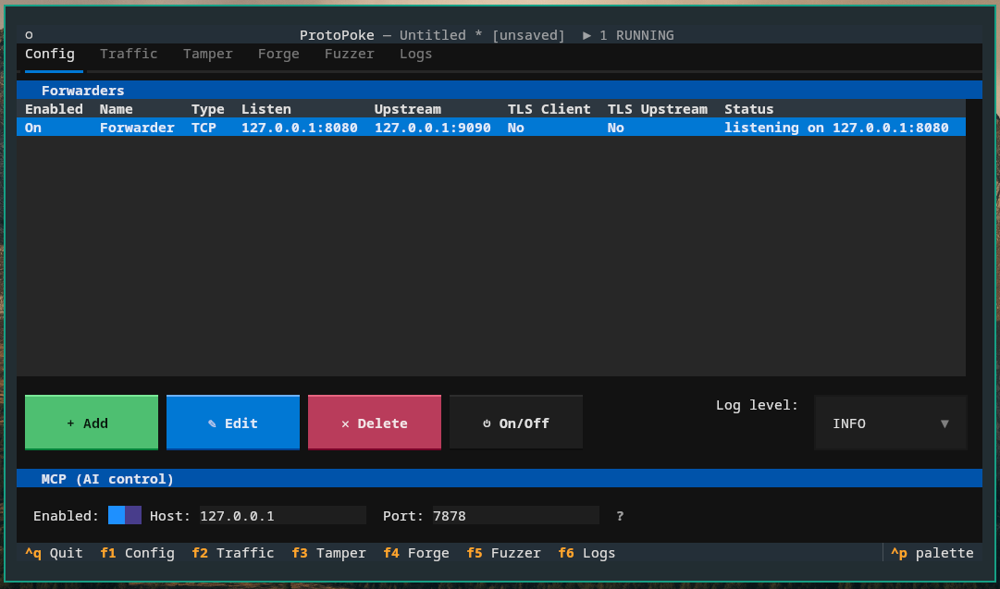
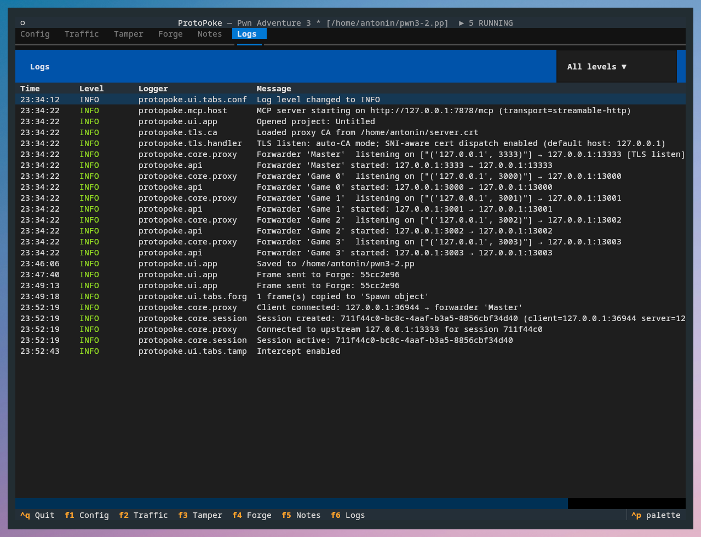

The **Config** tab (`F1`) is where you define forwarders, control logging,
manage the embedded MCP server, and save your work as a project. Nothing is
proxied until you start a forwarder here.

## Forwarders

The top of the tab is a table of forwarders. Each row shows whether it is
enabled, its name, type, listen address, upstream address, TLS status, and
running status.

| Button | Action |
|--------|--------|
| **+ Add** | Create a new forwarder |
| **✎ Edit** | Edit the selected forwarder (disabled while it is running) |
| **✕ Delete** | Remove the selected forwarder (asks for confirmation) |
| **⏻ On / Off** | Start or stop the selected forwarder |

Multiple forwarders can run at once, each proxying a different target — and
they can mix transports (one TCP, one UDP, one SOCKS5).

## Editing a forwarder

**Edit** (or **Add**) opens the forwarder modal. The form adapts to the
**Type** you choose:

| Field | Notes |
|-------|-------|
| **Name** | Human-readable label shown across the UI. |
| **Enabled** | Whether "Start All" includes this forwarder. |
| **Type** | `TCP`, `UDP`, or `SOCKS5` (see below). |
| **Listen Host / Port** | The address your client connects to. The host is a dropdown of available interfaces. |
| **Upstream Host / Port** | The real server. **TCP/UDP only** — SOCKS5 discovers the target from each client's handshake. |
| **Connect timeout** | How long to wait for the upstream connection. |
| **Read buffer size** | Bytes read per socket read. |
| **Max sessions** | Concurrency cap (`0` = unlimited). |
| **Half-open timeout** | Seconds an idle [half-open session](#half-open-sessions-tcp-socks5) may sit before its surviving connection is reaped (`0` = off). TCP/SOCKS5 only. |
| **Framer** | How the byte stream is cut into frames — `raw`, `delimiter`, `length_prefix`, or a custom script. Configured via the framer sub-modal. See [Framers](../reference/framers.md). |
| **Protocol definition** | Path to a YAML/JSON file for decoding frames into named fields. See [Protocol Definitions](../reference/protocol-definitions.md). |
| **TLS** | TLS termination on the client side and/or TLS to the upstream — see below. |
| **Log level** | Optional per-forwarder override of the global log level. |

### Transport types

- **TCP** — a plain stream proxy. Supports any framer and TLS.
- **UDP** — one session per `(client host, client port)` flow. Always uses
  the `raw` framer (one datagram = one frame); the framer selector and
  TLS-listen option are disabled. UDP has no half-close.
- **SOCKS5** — the upstream target is discovered from each client's CONNECT
  request, so the upstream host/port fields are hidden. The form shows
  optional username/password fields instead; leave them blank to advertise
  no-auth.

### Half-open sessions (TCP / SOCKS5)

When one peer disconnects, ProtoPoke does **not** immediately tear down the
other side. The session moves to `only server` or `only client` and the
surviving connection stays open, so you can keep driving it from the
[Forge](forge.md) tab. The session only reaches `closed` once both sides are
gone. This is on by default; the legacy TCP half-close behaviour can be
restored per-forwarder.

A half-open connection whose surviving peer uses keep-alive may never close on
its own, leaking its sockets indefinitely. The **Half-open timeout** field
guards against this: once a session is half-open, its surviving connection is
reaped after that many seconds with no traffic. Active connections and Forge
traffic reset the timer. It defaults to `0` (no reaping) — set a positive
value for long-running, unattended forwarders.

### TLS

ProtoPoke can terminate TLS on the client side and optionally
re-encrypt to the upstream:

- **TLS Listen** — terminate TLS coming from the client. On first use
  ProtoPoke generates a root CA at `~/.protopoke/ca.crt` / `ca.key` and signs
  a per-session certificate from it. **The client must trust that CA** for
  the handshake to succeed — export `~/.protopoke/ca.crt` and install it in
  the client's trust store. You can also point the forwarder at your own
  CA cert/key, or supply a fixed leaf cert/key directly.
- **TLS Upstream** — connect to the real server over TLS. Upstream
  certificate verification is intentionally disabled — ProtoPoke is a
  reverse-engineering tool, not a production proxy.

`TLS Listen` is not available for UDP (no DTLS) or SOCKS5 forwarders.

## Logging

A **log level** dropdown on the Config tab (`DEBUG` / `INFO` / `WARNING` /
`ERROR`) sets the global logging level for all forwarders. A forwarder can
override it in its own edit form.

Log output itself is shown on the **Logs** tab (`F6`): a table of timestamp,
level, logger name, and message, colour-coded by severity, with a level
filter dropdown. Use `DEBUG` while reverse engineering a protocol, then dial
it back once things work.

## MCP server

Below the forwarder table is the **MCP** section. Toggle it on to start the
embedded MCP server, which exposes ProtoPoke's operations as AI tools bound
to the *same* state the UI shows. Configure host/port here, and click the
**?** button for a help modal that shows the connection URL and explains the
**Profile** selector. That selector chooses the tool surface exposed to the
AI — `Full` (everything) or `Analysis` (the reverse-engineering subset, which
lowers per-turn token cost); changing it restarts the embedded server. See
[MCP Server](../mcp/overview.md).

## Projects

A **project** bundles your whole working set into a single `.pp` file (a ZIP
archive) so you can save and reopen it later.

| Action | Shortcut |
|--------|----------|
| Open project | `Ctrl+O` |
| Save project | `Ctrl+S` |
| Save as… | `Alt+S` |

The app starts with a blank `Untitled` project. The **project name** is set (and
can be edited) in the Save dialog: the first save — `Ctrl+S` on a fresh project,
or `Alt+S` — opens a dialog with a *Project name* field alongside the
destination path. Once saved, `Ctrl+S` writes silently back to the same file.

A `.pp` archive contains:

| Member | Contents |
|--------|----------|
| `project.json` | Metadata: name, timestamps |
| `forwarders.json` | All forwarder configurations |
| `rules.json` | Replace rules and intercept rules |
| `forge.json` | Playbooks, frames, and run history |
| `logs.json` | Captured sessions and frames (the Traffic tab) |
| `filters.json` | Frame display filters |
| `mcp.json` | Embedded MCP server settings (enabled, host, port, profile) |

Loading is bounded for safety (max 32 members, 100 MB per member).

## Next

- [Traffic](traffic.md) — read captured traffic, choose framers and parsers
- [Core Library — Config](../core/config.md) — the same, via `ForwarderConfig`
