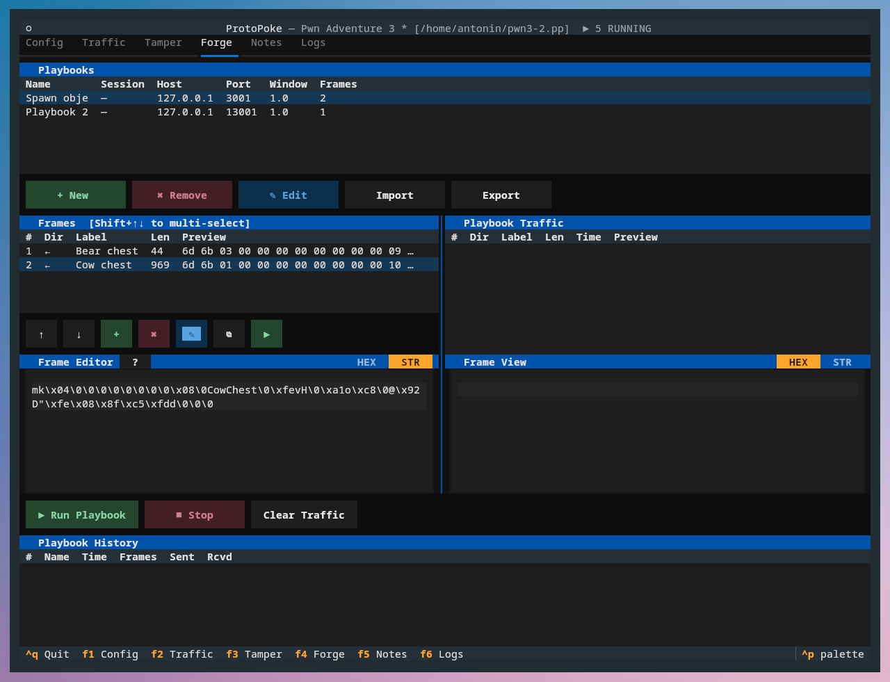

The **Forge** tab (`F4`) is where *you* generate traffic — like Burp
Suite's Repeater, but built around reusable **playbooks**. Hand-craft frames
from scratch or pull them in from captured traffic, edit them, and fire them
at a target.

## Core concepts

- **Playbook** — an ordered list of frames aimed at a destination. A playbook
  either opens a **fresh connection** (host/port) or **reuses an existing
  proxy session**.
- **Frame** — one message in a playbook. It has bytes, a label, and a
  direction (`→` send toward the server, `←` inject toward the client), and
  may contain `{{VARIABLE}}` template placeholders.
- **History** — every playbook run is recorded so you can review what was
  sent and received afterwards.

## Playbooks

The playbook list shows each playbook's name, source session, host, port,
**response window**, and frame count.

| Button | Action |
|--------|--------|
| **+ New** | Create a playbook |
| **✎ Edit** | Edit name, session/host/port, and response window |
| **✖ Remove** | Delete the playbook |
| **Import / Export** | Load/save a single playbook to a standalone `.json` file |

### Import / Export

**Export** writes the selected playbook to a standalone `.json` file. It saves
everything needed to replay the playbook later or on another machine:

- the connection config — **host**, **port**, **TLS** flag, **transport**, and
  **response window**;
- the playbook's **variables**; and
- all **frames** (bytes, label, and direction).

It deliberately does **not** save the bound session, the playbook's internal
ID, or the run **history**. A session only exists inside the running process
that created it, so an exported playbook can never reattach to it. On
**import** the playbook is given a fresh ID and starts **unbound**, so its
first run opens a new connection to the saved host/port. Edit the imported
playbook afterwards if you want to point it at a live session instead.

The same rule applies when you save and reopen a **project** (`.pp`): the
connection config and variables are preserved, but the session binding is
cleared on load so reopened playbooks reconnect to host/port rather than
refusing to run against a session that no longer exists.

### Reuse a session or start fresh

When you create or edit a playbook you choose its destination:

- **Fresh connection** — set a host, port, TLS flag, and transport. Each run
  opens a new connection.
- **Existing session** — point the playbook at a live proxy or forge session
  by its ID. Frames are injected into that session instead. This is what
  makes [half-open sessions](/ui/config#half-open-sessions-tcp-socks5) useful:
  if the client disconnected, you can keep driving the upstream from a
  playbook.

### The response window

A playbook's **response window** (in milliseconds) is how long it waits for
responses *after* sending its last frame before considering the run
complete. Raise it for slow servers; lower it for snappy request/response
protocols.

## Frames

The frames list shows each frame's index, direction, label, byte length, and
a hex preview. Select one to load it into the editor; `Shift` + arrows
extends a multi-frame selection.

| Button | Action |
|--------|--------|
| **↑ / ↓** | Reorder the selected frame |
| **+ Add frame** | Add a frame — **from scratch** or by **copying from Traffic** |
| **✖ Remove** | Delete the frame |
| **✎ Edit** | Edit the frame's label and direction |
| **⧉ Copy** | Copy the frame **into another playbook** |
| **▶ Send** | Send just the selected frame(s) immediately on the playbook's session |

### Two ways to get frames

- **From scratch** — **+ Add frame**, then type bytes in the editor.
- **From traffic** — on the [Traffic](/ui/traffic) tab, select captured
  frame(s) and click **→ Forge**. They land in a new or existing playbook,
  preserving their bytes and direction.

You can also **copy a frame from one playbook to another** with **⧉ Copy** —
handy for assembling a sequence out of pieces from different captures.

### The frame editor

The editor on the right edits the selected frame's bytes. It has a
**HEX / STR** toggle and supports `{{VARIABLE}}` placeholders, which are
resolved at send time from the shared variable store (the same store that
[custom replace scripts](/reference/replace-scripts) write to). Edits
auto-save when you switch frames.

## Running a playbook

The run bar has **▶ Run Playbook** (executes all frames in order),
**■ Stop**, and **Clear Traffic**. While a run is in progress:

- The **Playbook Traffic** pane fills with every frame sent and response
  received, timestamped relative to the start of the run.
- The **Frame View** pane shows the selected traffic entry in hex or string
  form.

## History

The **History** pane lists past playbook runs — run number, playbook name,
timestamp, frame count, bytes sent, and bytes received — so you can compare
runs and confirm what actually went over the wire.

## Next

- [Custom Replace Scripts](/reference/replace-scripts) — populate `{{VARIABLE}}` values
- [Core Library — Forge](/core/forge) — playbooks and replay via the API
