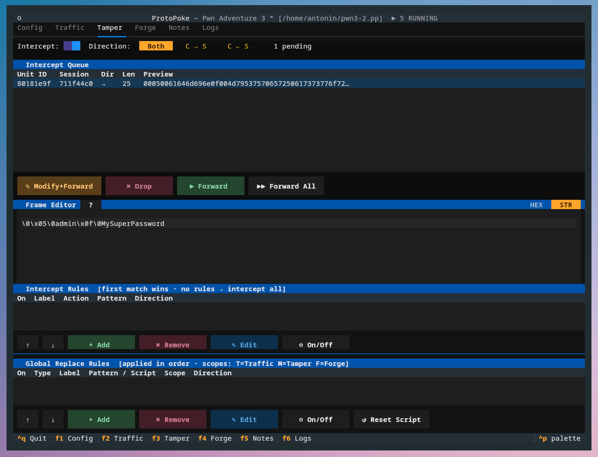

The **Intercept** tab (`F3`) is ProtoPoke's Burp-style review queue: hold
frames mid-stream, inspect them, edit them, then forward or drop them. It
also hosts the **intercept rules** that decide *what* gets held and the
**replace rules** that rewrite traffic automatically.

## Enabling intercept

The top bar has the intercept on/off toggle, a **direction filter**
(Both / C→S / S→C), and a count of pending frames. With intercept on, frames
are held in the queue instead of being forwarded automatically.

## The queue and verdicts

Intercepted frames appear in the queue table. Select one and choose a
verdict from the action bar:

| Verdict | Effect |
|---------|--------|
| **Modify + Forward** | Edit the bytes in the hex editor, then send |
| **Drop** | Discard the frame silently |
| **Forward** | Send it unchanged |
| **Forward All** | Release every pending frame |

The **hex editor** below the queue edits the selected frame. It has a
**HEX / STR** toggle — HEX is space-separated bytes, STR is a UTF-8 view
where bytes that are not valid UTF-8 are shown in escaped `\xNN` form. Click
the help button for the exact encoding rules.

## Intercept rules

Holding *every* frame is rarely what you want. **Intercept rules** define an
explicit allow-list of which frames to stop. They live in the Intercept Rules
table; each rule has an on/off toggle, a label, an action, a byte pattern,
and a direction.

- Rules are evaluated **in order — first match wins**.
- A rule's action is either **Intercept** (hold it) or **Forward** (let it
  pass without stopping).
- If rules exist but none match a frame, the frame is **auto-forwarded**.
- If there are no rules at all, *every* frame is intercepted.

Use **+ Add** / **✎ Edit** / **✕ Remove** / **↑ ↓** to manage and reorder
them. A common pattern: a `Forward` rule for noisy heartbeats, then an
`Intercept` rule for the messages you actually care about.

## Replace rules

**Replace rules** rewrite byte patterns in frames automatically — no manual
interception needed. They run *before* the intercept check and can apply to
proxied traffic, tampered frames, and forged frames depending on each rule's
**scope** flags.

Rules run **in order**; a later rule sees the bytes already modified by
earlier rules. Manage them in the Global Replace Rules table
(**+ Add** / **✎ Edit** / **✕ Remove** / **↑ ↓**, plus **🔄 Reset** to clear
the cached module of a script rule).

### Rule types

| Type | What it does |
|------|--------------|
| **Binary** | Match a byte sequence with a readable hex pattern syntax (wildcards `??`, ranges `[03-09]`, repeats `.{2,8}`, alternation `(01\|02)`, anchors `^` `$`) and substitute a fixed replacement. |
| **Regex** | Match and replace with a Python bytes-regex; supports `\xNN` escapes and `\g<N>` group backreferences. `re.DOTALL` is always on. |
| **Script** | Run a Python function you write — full programmatic control, can parse fields, keep state, and stash values for Forge. See [Custom Replace Scripts](../reference/replace-scripts.md). |

### Options

When adding or editing a replace rule you set:

- **Label** — a name for the rule.
- **Type** — binary / regex / script (the input fields change accordingly).
- **Pattern / replacement** (binary & regex) or **script path** (script).
- **Direction** — restrict to client→server, server→client, or both.
- **Scope** — three checkboxes:
  - *Traffic* — every frame through the proxy relay (before the queue)
  - *Tamper* — bytes you change in **Modify + Forward**
  - *Forge* — frames sent from the Forge tab or a playbook

  All three default to on; turn one off to limit where the rule applies.

!!! tip "When a binary rule is not enough"

    Binary and regex patterns are blind to *structure* — they cannot
    reliably edit nested length-prefixed fields without corrupting
    neighbouring data. When that happens, switch to a **script** rule, which
    can actually parse the message. The [DNS guide](../guides/dns.md) walks
    through exactly this trade-off.

## Next

- [Custom Replace Scripts](../reference/replace-scripts.md) — the `apply()` API
- [Forge](forge.md) — send and replay traffic
- [Core Library — Intercept](../core/intercept.md) — the same, via the API
